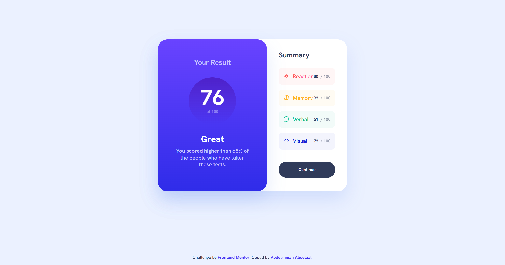

# Frontend Mentor - Results summary component solution

This is a solution to the [Results summary component challenge on Frontend Mentor](https://www.frontendmentor.io/challenges/results-summary-component-CE_K6s0maV). Frontend Mentor challenges help you improve your coding skills by building realistic projects.

## Table of contents

- [Overview](#overview)
  - [Screenshot](#screenshot)
  - [Links](#links)
- [My process](#my-process)
  - [Built with](#built-with)
  - [What I learned](#what-i-learned)
- [Author](#author)

## Overview

### Screenshot

### Links

- Solution URL: [GitHub](https://github.com/MrBlackvanta/results-summary-component)
- Live Site URL: [Netlify](https://vanta-results-summary-component.netlify.app)

## My process

### Built with

- React + Vite
- TypeScript
- Tailwind CSS v4 (`@theme` tokens, `@utility` for typography, gradients, and reusable component styles)
- Component-based layout (`ResultSummary` in `src/components`)
- Mobile-first responsive design with `sm:` breakpoint for desktop two-column layout
- Hanken Grotesk variable font loaded locally (`src/assets/fonts`)
- Custom SVG icon components with theme-aware stroke colors

### What I learned

- Using Tailwind v4’s `@utility` directive for complex styles like gradient overlays and animated hover effects (pseudo-element opacity trick for transitioning gradients).
- Applying gradients as text color with `bg-clip-text` and `text-transparent`.
- Structuring data-driven components: separating score data, types, and icon components with barrel exports and path aliases for clean imports.
- Semantic HTML choices: proper heading hierarchy, `aria-hidden` on decorative icons, and using grid rows (`grid-rows-[1fr_auto]`) instead of absolute positioning for robust footer placement.
- Computing derived values (average score) from data rather than hardcoding them.

## Author

- UpWork - [Abdelrhman Abdelaal](https://upwork.com/freelancers/~01f0a9479696b61f49)
- Frontend Mentor - [@MrBlackvanta](https://www.frontendmentor.io/profile/MrBlackvanta)
- LinkedIn - [@yourusername](https://www.linkedin.com/in/abdelrhman-vanta/)
