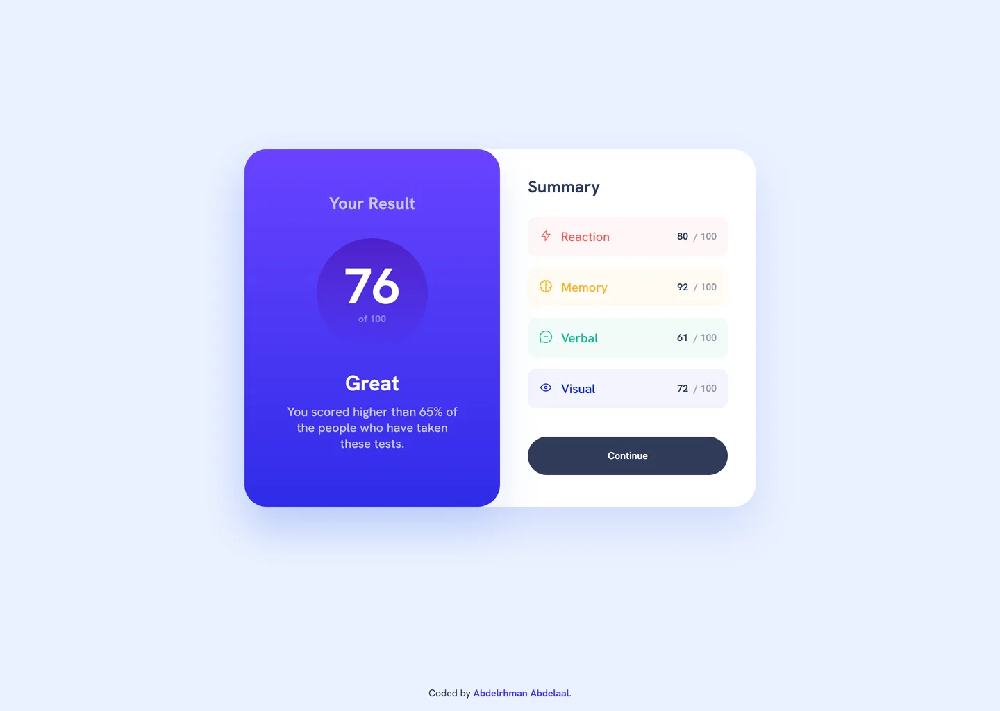

# Results summary component

My solution to the [Results summary component](https://www.frontendmentor.io/challenges/results-summary-component-CE_K6s0maV)
challenge on Frontend Mentor.

- Live: https://results-summary-component.abdelrhman-ahmed8881.workers.dev
- Code: https://github.com/MrBlackvanta/results-summary-component

## Built with

- React and Vite
- TypeScript
- Tailwind CSS v4
- Hanken Grotesk, self-hosted

## Notes

The average score is computed from the data rather than typed in, so the two can't drift
apart.

Score categories live in one array with their icon and colour, which keeps the JSX to a
map instead of four near-identical blocks.

The card is a two-row grid (`grid-rows-[1fr_auto]`) so the button sits at the bottom
without absolute positioning, and it survives the content getting taller.

Gradients are `@utility` classes. The heading uses `bg-clip-text` with transparent text
to run the gradient through the type, and the hover state cross-fades a second gradient
on a pseudo-element, since gradients themselves don't transition.

## Author

- [LinkedIn](https://www.linkedin.com/in/abdelrhman-vanta/)
- [UpWork](https://www.upwork.com/freelancers/mrblackvanta)
- [Frontend Mentor](https://www.frontendmentor.io/profile/MrBlackvanta)
